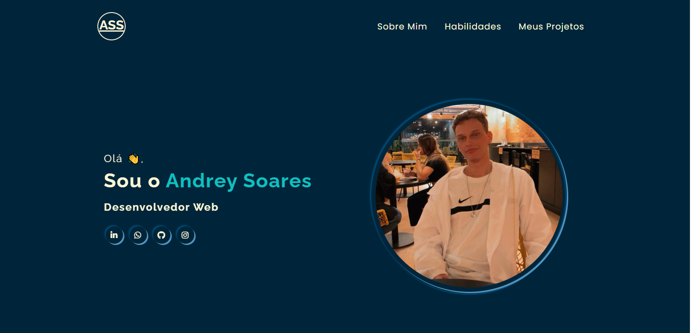

<h1 align="center">
  Andrey Santana Soares - Portfólio   
</h1>

  Este é meu portfólio pessoal <a href="" target="_blank">Andrey Santana Soares - Desenvolvedor Web,</a> é um website que
 contém informações sobre mim, minhas habilidades e meus projetos, atualmente hospedado no <a href="https://github.com/Drey021">GitHub-Pages</a>.

## Demostração

## Tecnologias utilizadas:

 * HTML
 * CSS
 * JAVASCRIPT

### 🔗 Link do Portfólio: <a href="https://matias-ezequiel-correa.github.io/Portfolio1-MatiasCorrea/" target="_blank">matias-ezequiel-correa.github.io/Portfolio1-MatiasCorrea/</a>

 ### Pra entrar em contato, veja as redes abaixo!
 

 
  
  
   

